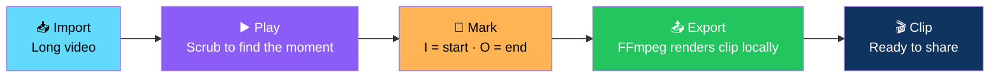

# 🎬 Reel Repurposer

<div align="center">


**Import a long video, play it, mark a start/end, and export the clip locally.**

*100% local. No cloud. No uploads. No accounts.*

[✨ Overview](#-overview) • [🚀 Setup](#-setup) • [⌨️ Shortcuts](#-shortcuts) • [🧪 Tests](#-tests) • [📝 Status](#-status)

</div>

---

## 📖 Overview

**Reel Repurposer** is a **local desktop tool** for turning a long video into shareable clips — without uploading anything, without an account, and without leaving your machine.

Import a video, scrub through it, mark the start and end of the moment you want, and export the clip.

### Core Idea

> **100% local processing.**
>
> Your video never leaves your computer. FFmpeg does the work. Nothing is uploaded, nothing is stored in the cloud.

### The Flow



---

## 🚀 Setup

### 1. Install Python

**Python 3.11+** — from [python.org](https://www.python.org/)

> ⚠️ **Windows users:** tick **"Add to PATH"** during installation.

### 2. Install FFmpeg

Make sure **`ffmpeg`** and **`ffprobe`** are on your **PATH**.

| Platform | Command |
|----------|---------|
| **Windows** | `winget install Gyan.FFmpeg` |
| **macOS** | `brew install ffmpeg` |
| **Linux** | `sudo apt install ffmpeg` *(Debian/Ubuntu)* |

**Verify it worked:**

```bash
ffmpeg -version
ffprobe -version
```

### 3. Install Dependencies

```bash
pip install -r requirements.txt
```

### 4. Run

```bash
python main.py
```

---

## ⌨️ Shortcuts

| Key | Action |
|-----|--------|
| **`Space`** | Play / Pause |
| **`←` / `→`** | Seek 5 seconds |
| **`I`** | Set **start** |
| **`O`** | Set **end** |
| **`Ctrl+E`** | Export |

---

## 🧪 Tests

```bash
python -m pytest
```

---

## 📝 Status

> 🟡 **Engine (Phases 2–6 logic) done and tested.**
>
> **UI wiring for it is next.**

### What This Means

| Layer | Status |
|-------|:------:|
| **Engine** — Phases 2–6 logic | ✅ **Done and tested** |
| **UI wiring** | ⏭️ **Next** |

> 💡 **The hard part is behind us.** The clip extraction, timing math, and FFmpeg invocation are all in place. The UI is connecting the dots.

---

## 🗺️ Roadmap

### ✅ Current

- [x] Engine logic for Phases 2–6 — **done and tested**
- [x] Local FFmpeg-based clip export
- [x] `pytest` test suite
- [x] Keyboard-driven workflow — Space / arrows / I / O / Ctrl+E

### 🔜 Next

- [ ] **UI wiring for the engine**
- [ ] Timeline scrubber with visual start/end markers
- [ ] Clip preview before export
- [ ] Export presets — resolution, format, quality
- [ ] Batch export — multiple clips from one video
- [ ] Auto-chapter detection
- [ ] Subtitle burn-in
- [ ] Drag-and-drop video import

---

## 🤝 Contributing

Contributions are welcome. Please:

1. Fork the repository
2. **Keep processing local** — no cloud calls, no uploads, no telemetry
3. **Never shell out unsafely** — use argument lists, not string concatenation
4. **Add tests** for any new engine logic
5. **Preserve the keyboard workflow** — it's what makes the tool fast
6. Submit a Pull Request

### Guidelines

- **Never trust a user-supplied filename** — sanitize before it touches a shell
- **Never require a cloud account** — the whole point is local
- **Never ship a fake export** — either it renders or it errors clearly
- **Never break existing shortcuts** — muscle memory is the tool's value

---

## 📜 License

MIT — see [LICENSE](LICENSE) for details.

---

## 🙏 Acknowledgments

- **FFmpeg** — for making local video processing this powerful
- **Every creator who's ever needed one 30-second clip from a 2-hour recording** — this is for you

---

<div align="center">

### 🎬 IMPORT. MARK. EXPORT.

**Long video in. Short clip out.**

**100% local. No cloud. No accounts.**

<br>

⭐ If this tool helped you, consider giving it a star.

<br>

[⬆ Back to Top](#-reel-repurposer-)

</div>
